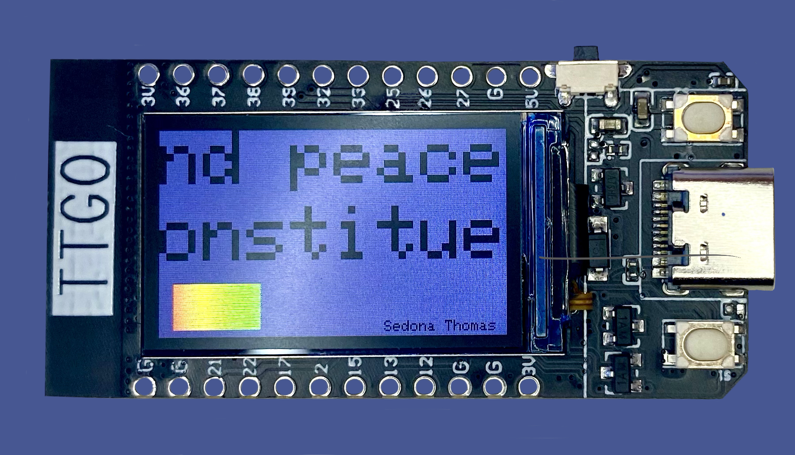

# Text Visualization
## ESP32 TTGO T-Display text visualization

A generative art installation on an  ESP32 TTGO T-Display that visualizes the UDHR in English and French for Professor Mark Santolucito's Creative Embedded Systems (COMS 3930) Course in Spring 2022

## Materials

 - ESP32 TTGO T-Display
 - 500 mAh battery

## Make at Home

### Setup Arduino

- Download and open the Arduino IDE ([Download](https://www.arduino.cc/en/software))
- Open Preferences and add the ESP package at the following link by copying and pasting it into `Additonal Boards Manager URLs` ([https://dl.espressif.com/dl/package_esp32_index.json](https://dl.espressif.com/dl/package_esp32_index.json))
- Select `Tools > Boards > ESP32 Arduino > TTGO T1`
- Select `Tools > Manage Libraries`, then search for `TFT_eSPI` and install the most recent version
- In your file storage system, find the Arduino folder
- Open `Arduino/libraries/TFT_eSPI/User_Setup_Select.h`
- Comment out the line that says `#include <User_Setup.h>`
- Uncomment the line that says `#include <User_Setups/Setup25_TTGO_T_Display.h>`

### Test ESP32 TTGO T-Display

- Open the Arduino IDE
- Select `Files > Examples > TFT_eSPI > 160 x 128 > RLE_font_test`
- Plug in the ESP32 TTGO T-Display
- Select `Sketch > Upload`

### Run Text Visualization

- Open `./Text_Visualiztion/Text_Visualization/Text_Visualization.ino` the Arduino IDE
- Plug in the ESP32 TTGO T-Display
- Select `Sketch > Upload`

## More Information

Medium Blog Post: https://medium.com/@sedonathomas/generative-art-9378c338fe06

Youtube Demo: https://www.youtube.com/watch?v=hJqq8oLx8cU&feature=youtu.be
